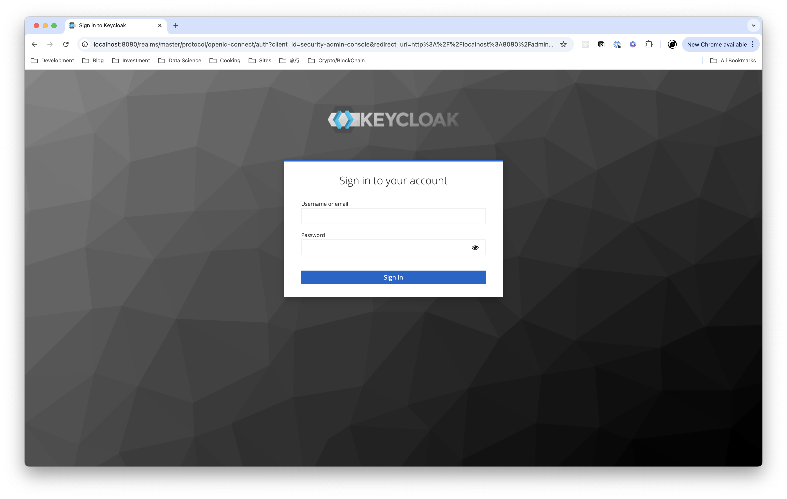
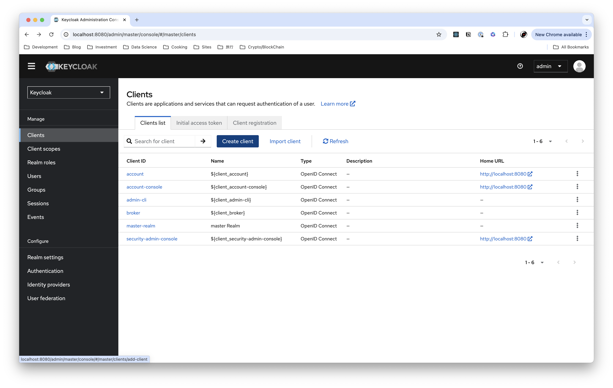
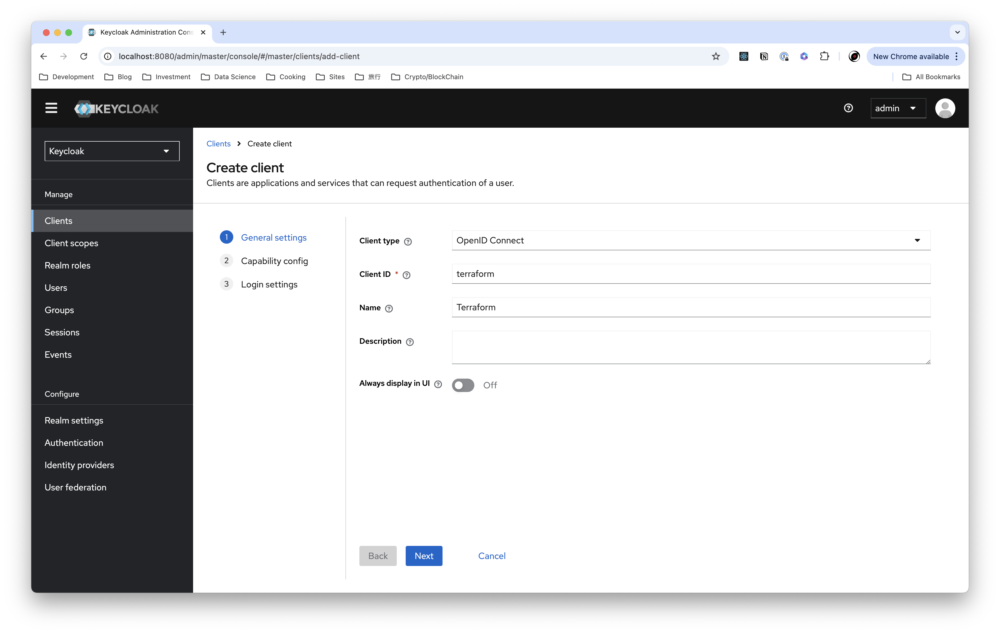
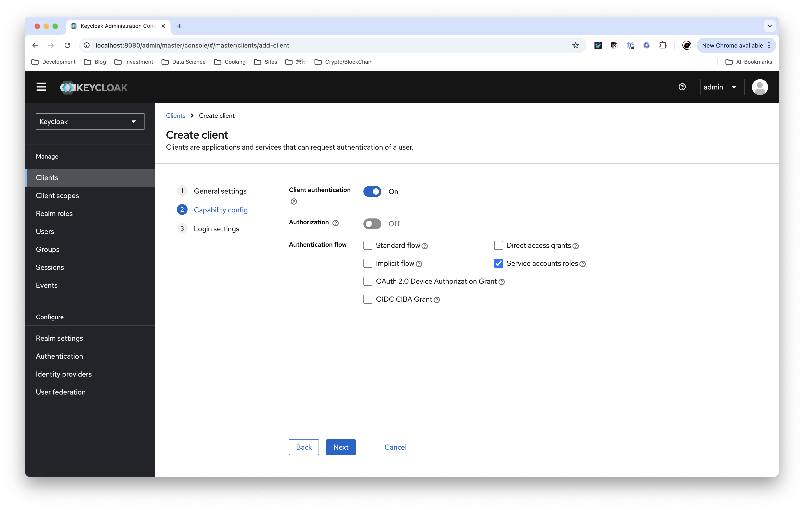
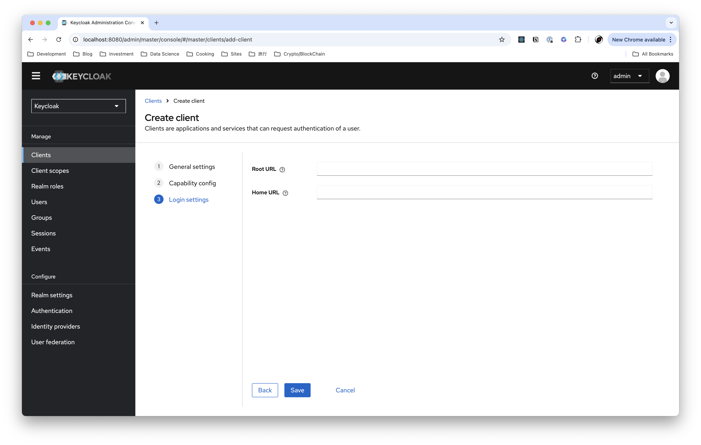
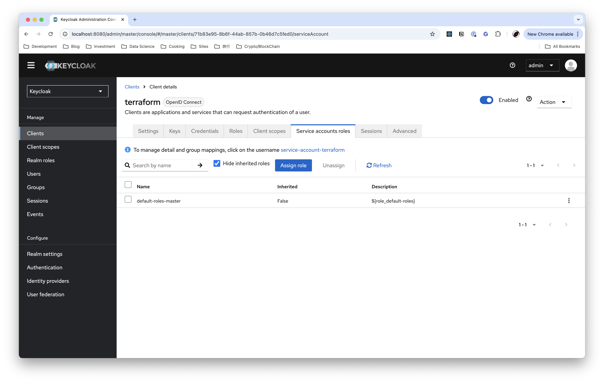
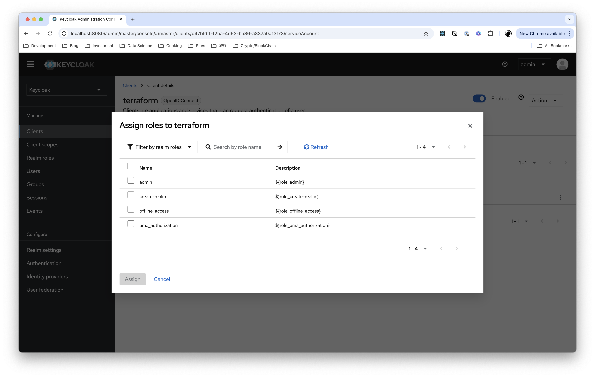

# Setup Keycloak with Terraform

## Prerequisites

- Terraform CLI

## Open Keycloak Admin Console

Open http://localhost:8080 and login with the following credentials:

- Username: admin
- Password: admin

## Create a client for the Terraform Provider

- Click `Create Client`

- Fill in the form with the following information:
  - Client type: openid-connect
  - Client ID: terraform
  - Name: Terraform

- Client authentication: On
- Service accounts roles: On
- Other settings: off

- Leave both `Root URL` and `Home URL` blank and click `Save`

- Open `Service Account` tab and click `Assign Role`

- Select all roles and click `Assign`

- Select `Filter by realm roles` and select `admin`